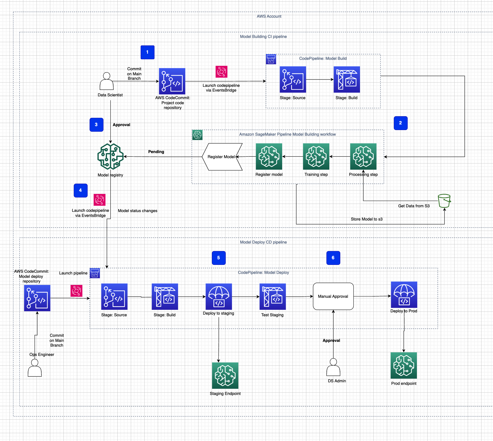

# bits-webminar-june-24

This repository contains a series of Jupyter notebooks numbered from 01 to 07.
Focusing on building mlops ci cd pipeline using sagemaker.
Demonstrating the overall architecture as below:

Below is an overview of each notebook:
> Notebook 01: [Exploratory data analysis]

> Notebook 02: [Local model training]

> Notebook 03: [Sagemaker containers for model training.]

> Notebook 04: [Sagemaker pipelines]

> Notebook 05: [Mlops model building ci pipeline]

> Notebook 06: [Model model deploy cd pipeline]

> Notebook 07: [Testing a registered model from registry.]

> Notebook 08: [Clean-up]